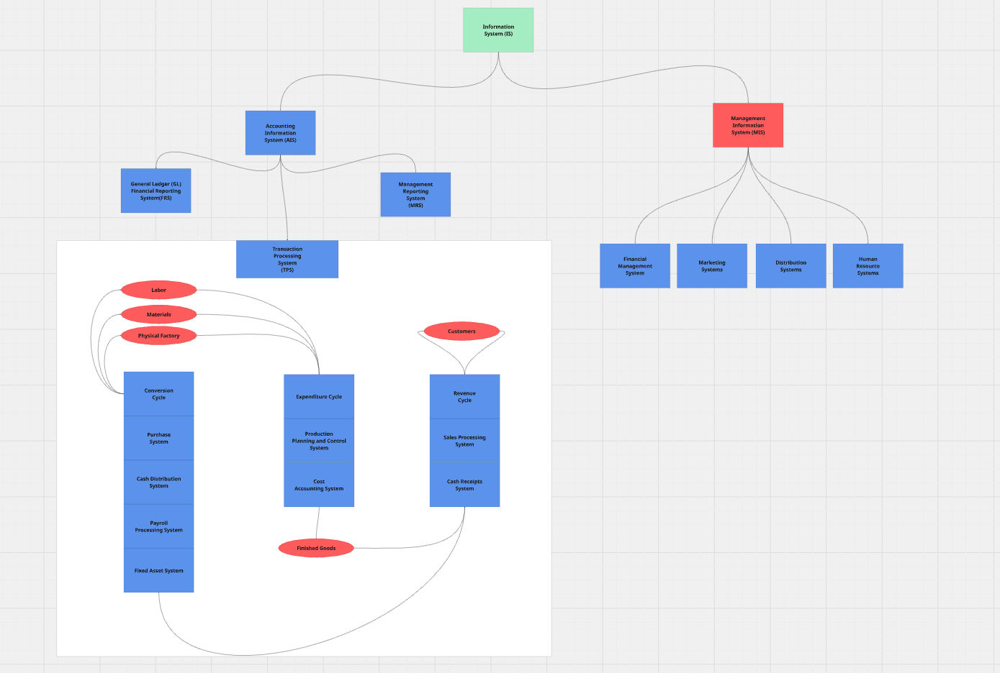
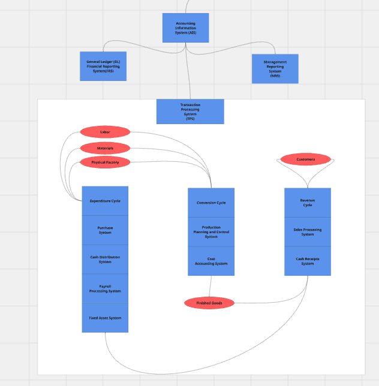

# Accounting-Information-Systems
Accounting Information Systems (AIS) is a type of Information System (IS). Often paired with a Management Information System (MIS). One of the biggest differences between the two is that the AIS will hold Financial transactions while the MIS will have nonfinancial transactions such as supplier lists. Although within the AIS there are also nonfinancial transactions within a subsystem called the Management Reporting System (MRS). The main purpose of the AIS is to control the flow of information mainly in relation to Financial information for the purpose of accurate cost accounting for Cost of Goods Manufactured, and Cost of Goods Sold, and more. 

# Overview Accounting Information Systems (AIS)

The AIS is made up of three main subsystems the General Ledger/Financial Reporting System (GL/FRS), Transaction Processing System (TPS), and the Management Reporting System (MRS).

## Accounting Information System
### General Ledger/Financial Reporting System (GL/FRS)
The General Ledger consists of the main Database that stores all Financial Information related to the TPS and it's Subsystems. Which is then updated via the GL Dept. by the General Ledger Function. 

### Transaction Processing System (TPS)
The TPS consists of Financial and Non-Financial Information and updates the General Ledger via Journal Vouchers which are Batches of Periodic Financial Information. 

### Management Reporting System (MRS)
The MRS Subsystem creates various Financial Documents such as the Balance Sheet, the Statement of Cash Flow and the Income Statement based on the changes in the A/R, A/P, and other Dept. Accounts. Theses Nondiscretionary Reporting Documents are signed off by the CEO, CFO based on the SEC's SOX Section 302. Theses Variance Reports are vital Documents required by the SEC for Publicly trading companies for their 10Ks and 10Qs. 

## Management Information System (MIS)
The MIS consists mainly of reference files which are then referenced by the TPS such as valid vendor files, and suppliers, as well as other non-financial documents that are required by the TPS to complete various Functions within the TPS. 

### Financal Management Systems
- Portfolio Management Systems
- Capital Budgeting Systems

### Marketing Systems
- Market Analysis
- New Product Development
- Product Analysis

### Distribution Systems
- Warehouse Organization and Scheduling
- Delivery Scheduling
- Vehicle Loading and Allocation Models

### Human Resource Systems 
- Human Resource Management Systems
- Job Skill Tracking System
- Employee Benefits System

# Transaction Processing System (TPS)
The TPS is an important Cycle within the AIS which is where most transaction processes happen within an organization. The TPS consists of three main Subsystems: the Expenditure Cycle, the Conversion Cycle and the Revenue Cycle. As well as where the various Depts. using various Function update other Depts. and eventually send Journal Vouchers to periodically batch update the GL. 

## Revenue Cycle
The Revenue Cycle consists of two main Subsystems the Sales Order Processing Subsystem, the Cash Receipts Subsystem. 

### Sales Order Processing Subsystem Procedures
This Subsystem entails the processing of customer orders, and fufillment of the order and the shipping process, and the billing, and the journalization of the transaction. 

#### Receive Order
Customer Order - Type, Quantity
Transcription of customer order to sale order - name, address, acct#, order info (#, unit price, description)

#### Check Credit
Authorization from management to verify customer's credit on supplier file. 

#### Pick Goods
A Picking Ticket/Stock Release is issued to pick goods at the warehouse. 
1. Then sends verified stock release to ship goods task.
2. Back order record is kept on file until inventory is stocked.
3. warehouse adjusts stock records to reduce inventory.

#### Ship Goods
The Packing Slip is generated, as well as a Shipping Notice. The Shipping Notice automatically begins the process in which the billing of the Customer can begin. 

The reconcilation of the physical items with the Stock Release, Packing Slip, and the Shipping Notice. 

The Bill of Lading is created which is the contract between the seller and the shipping vendor. 

The Shipping Log is updated once shipped. The Shipping Notice and Stock Release Documents are forwarded to the customer as proof of shipment. 

#### Billing Customer
After the Shipping Notice is created the billing occures and generates an Sales Invoice. 

#### AR Dept. and Accounts Receivable Function 
The AR Dept Receives the Sales Invoice and updates their Accounts, and creates a Sales Journal Voucher at the end of the period, which is then sent to the GL via the General Ledger (GL) Function. 

#### Inventory Control Function 
The Inventory subsidiary ledger accounts within the TPS is updated from the information from the Stock Release Document. 

#### General Ledger Function 
The GL Function sends the Sales Journal Vouchers from AR, the Inventory Control Task, and the Account Summary and updates the GL.

## Expenditure Cycle

## Conversion Cycle 

