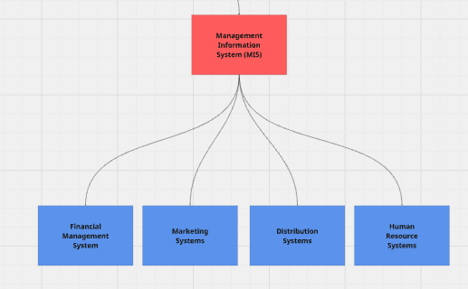

# Accounting-Information-Systems
Accounting Information Systems (AIS) is a type of Information System (IS). Often paired with a Management Information System (MIS). One of the biggest differences between the two is that the AIS will hold Financial transactions while the MIS will have nonfinancial transactions such as supplier lists. Although within the AIS there are also nonfinancial transactions within a subsystem called the Management Reporting System (MRS). The main purpose of the AIS is to control the flow of information mainly in relation to Financial information for the purpose of accurate cost accounting for Cost of Goods Manufactured, and Cost of Goods Sold, and more. 

# Overview Accounting Information Systems (AIS)

The AIS is made up of three main subsystems the General Ledger/Financial Reporting System (GL/FRS), Transaction Processing System (TPS), and the Management Reporting System (MRS).

# Overview Management Information System (MIS)

The MIS is made up of four main subsystems the Financial Management Systems, Marketing Systems, Distribution Systems, and the Human Resource System.

## Accounting Information System
### General Ledger/Financial Reporting System (GL/FRS)
### Transaction Processing System (TPS)
### Management Reporting System (MRS)

## Management Information System (MIS)
### Financial Management Systems
### Marketing Systems 
### Distribution Systems 
### Human Resource System

# Transaction Processing System (TPS)

## Expenditure Cycle
## Conversion Cycle 
## Revenue Cycle 

# Flowcharting 

